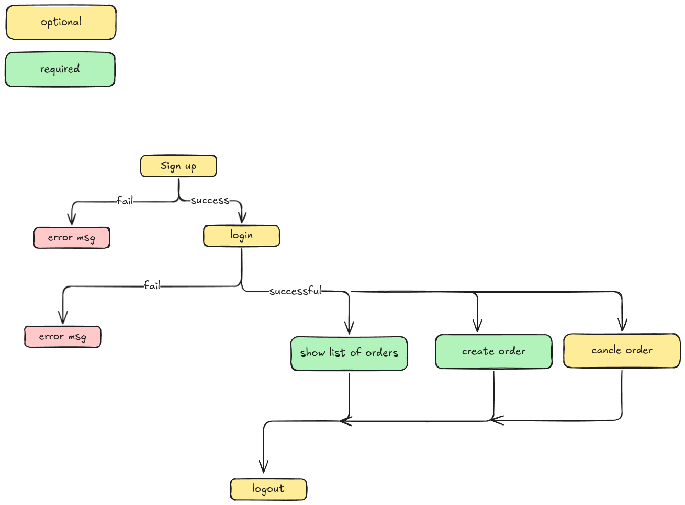
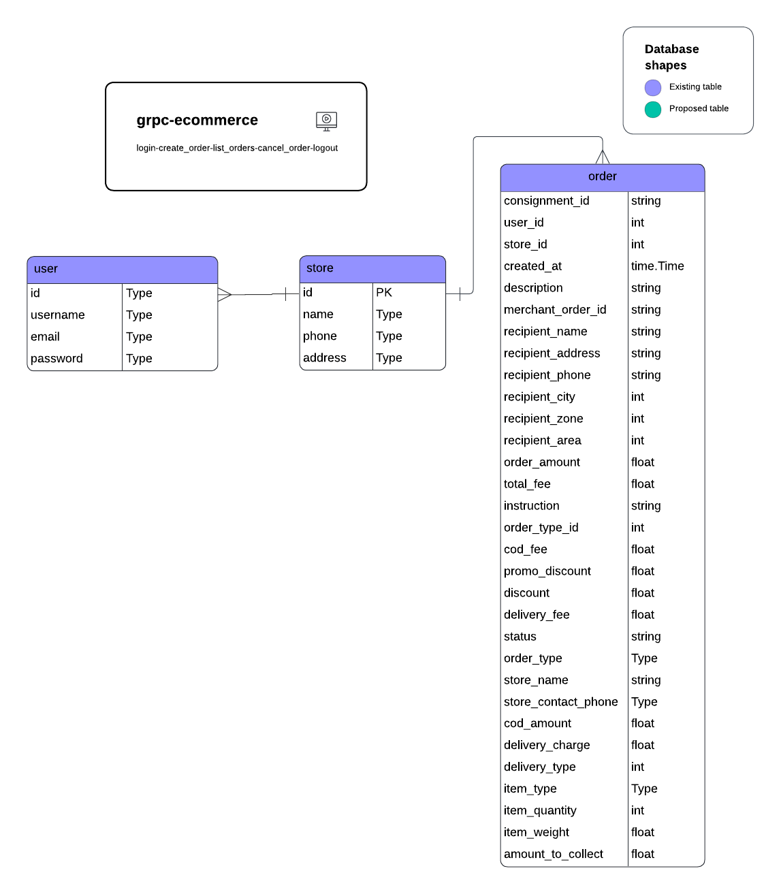

# Order Service gRPC API

A gRPC-based order management service built with Go, following hexagonal architecture. It supports user signup, login, order creation, listing, cancellation, and logout, with PostgreSQL as the data store and JWT-based authentication. I've followed `Hexagonal Architecture` to implement this project

## Features
- **Signup/Login**: Register and authenticate users with JWT tokens.
- **Order Management**: Create, list, and cancel orders with validation (e.g., phone number, required fields).
- **Fee Calculation**: Dynamic delivery and COD fees based on city and weight.
- **Persistence**: PostgreSQL for storing users and orders.
- **Authentication**: JWT middleware protects endpoints except Signup and Login.

## Project Structure
```
order-service/
├── cmd
│   └── server
│       └── main.go
├── Dockerfile
├── er-diagram.png
├── go.mod
├── go.sum
├── internal
│   ├── adapters
│   │   ├── grpc
│   │   │   ├── proto
│   │   │   │   ├── order_grpc.pb.go
│   │   │   │   ├── order.pb.go
│   │   │   │   └── order.proto
│   │   │   └── server.go
│   │   └── repository
│   │       └── postgres.go
│   ├── application
│   │   ├── auth_service.go
│   │   └── order_service.go
│   ├── domain
│   │   └── models.go
│   └── ports
│       └── ports.go
├── note-task.png
├── pkg
│   └── auth
│       └── jwt.go
├── readme.md
└── Task_ Software Engineer (GoLang).md
```

## Workflow


## DB Diagram


## Prerequisites
- Go 1.21+
- Docker
- PostgreSQL
- protoc (for generating gRPC code)

## Setup
1. **Generate gRPC Code**:
   ```bash
   protoc --go_out=. --go-grpc_out=. internal/adapters/grpc/proto/order.proto
   ```

2. **Run PostgreSQL**:
   ```bash
   docker run -d -p 5432:5432 -e POSTGRES_USER=postgres -e POSTGRES_PASSWORD=pass -e POSTGRES_DB=orderdb postgres
   ```

3. **Set Environment Variables**:
   ```bash
   export DB_HOST=localhost
   export DB_PORT=5432
   export DB_USER=postgres
   export DB_PASSWORD=postgres
   export DB_NAME=grpc-ecommerce
   ```

4. **Build and Run**:
   ```bash
   go mod tidy
   grpc-ecommerce
   ```

## Usage
- **Signup**: Register a new user.
  ```bash
  grpcurl -plaintext -d '{"username":"user@example.com","password":"pass"}' localhost:50051 order.OrderService/Signup
  ```
- **Login**: Authenticate and receive a JWT token.
  ```bash
  grpcurl -plaintext -d '{"username":"user@example.com","password":"pass"}' localhost:50051 order.OrderService/Login
  ```
- **Protected Endpoints**: Use the JWT token in the `authorization: Bearer <token>` metadata header for CreateOrder, ListOrders, CancelOrder, and Logout.

## Testing
- Use `grpcurl` or a custom gRPC client to interact with the API.
- Default user: `01901901901@mailinator.com` / `321dsaf` (inserted on startup).

## Dependencies
- `github.com/golang-jwt/jwt/v5`
- `google.golang.org/grpc`
- `github.com/lib/pq`

## Notes
- Passwords are stored in plain text for simplicity; use hashing (e.g., bcrypt) in production.
- JWT secret is hardcoded (`your-secret-key`); configure via environment variables in production.
- The service listens on port `50051`.

## License
MIT
```
